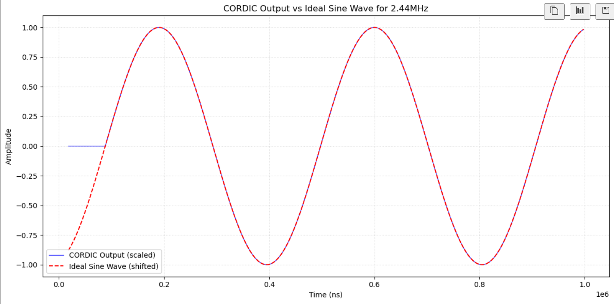
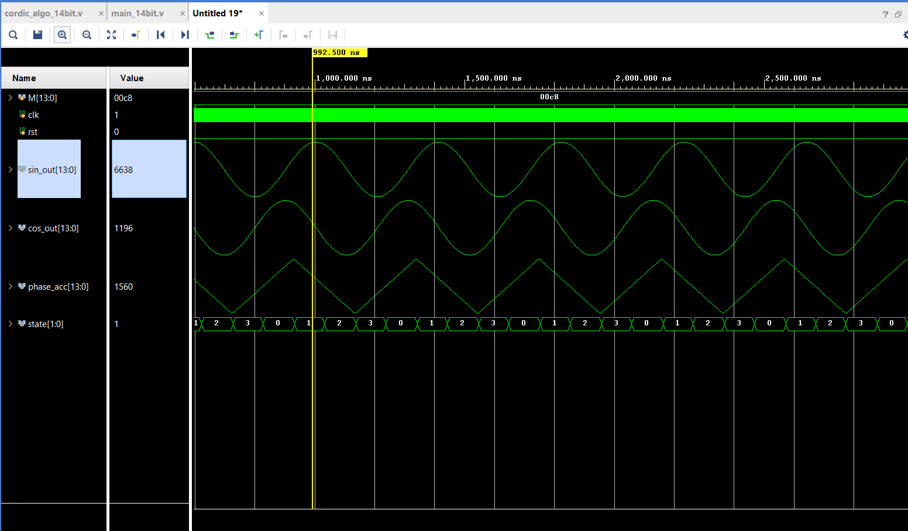

# Direct Digital Synthesis (DDS) Generator  
**Sine/Cosine Wave Generation using LUT & CORDIC**  
The phase bit width (12-bit) and data bit width (14-bit) were selected to match the requirements of my RF-SoC board and DAC interface. You can easily adapt these widths in the code to suit your hardware constraints." 

## 📌 Overview
Two Verilog-Vivado implementations of DDS (Direct Digital Synthesis):
1. **LUT-Based** (Look-Up Table) - Fast, memory-intensive  
2. **CORDIC-Based** - Iterative, memory-efficient  

## 🏗️ Repository Structure

- `DDS-Generator/`
  - `LUT_full_sine/` – LUT-based DDS
    - `full_sine.v` – Main DDS + Testbench
    - `blk_mem_gen_0.xci` – Xilinx Block ROM IP
    - `full_sin_LUT.coe` – Sine LUT Coefficients
    - `coe_full_sine.m` – MATLAB LUT Generator
    - `User_guide.md` – Usage Instructions
  - `CORDIC/` – CORDIC-based DDS
    - `main_14bit.v` – Main DDS + Testbench
    - `cordic_algo_14bit.v` – CORDIC RTL + Testbench
    - `User_guide.md` – Usage Instructions

## 🔧 LUT-Based DDS
### Features
- ✅ 12-bit phase
- ✅ 14-bit amplitude(one signed bit)
- ✅ Xilinx Block Memory optimized

### Usage
Check User guide in the LUT_full_sine directory

## ⚙️ CORDIC-Based DDS
### Features
- ✅ No precomputed tables
- ✅ Memory efficient
- ✅ Fully pipelined

### Usage
Check User guide in the Cordic directory

## 📊 Comparison
| Metric       | LUT-Based         | CORDIC-Based      |
|-------------|------------------|-------------------|
| **Latency** | 1 cycle          | (#iterations) cycles |
| **Memory**  | High (ROM)       | None              |
| **Precision**| Fixed           | Adjustable        |

